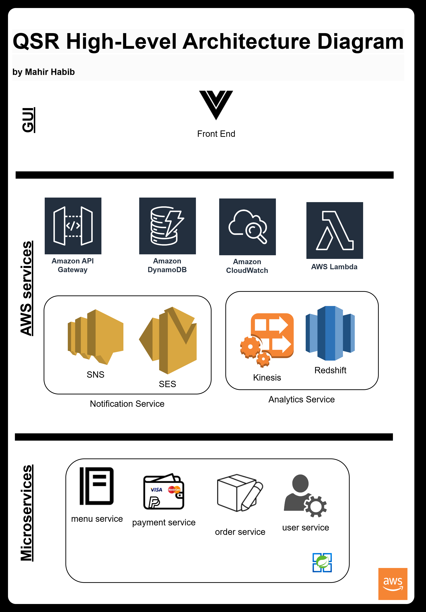

# QSR Ordering System

This project demonstrates how to build a serverless API for managing orders using AWS Lambda, API Gateway, and DynamoDB, utilizing the AWS Serverless Application Model (SAM).


## Part 1: System Overview and Deployment Instructions

### Prerequisites

Before you begin, ensure you have the following tools installed:

- **AWS CLI**: [Install AWS CLI](https://docs.aws.amazon.com/cli/latest/userguide/install-cliv2.html)
- **AWS SAM CLI**: [Install AWS SAM CLI](https://docs.aws.amazon.com/serverless-application-model/latest/developerguide/serverless-sam-cli-install.html)
- **Node.js and npm**: [Install Node.js](https://nodejs.org/)

### Architecture Overview

1. **API Gateway**: Acts as the entry point for HTTP requests.
2. **AWS Lambda**: Executes the business logic in response to API Gateway requests.
3. **Amazon DynamoDB**: NoSQL database for storing order data.
4. **Amazon CloudWatch**: For monitoring and logging.

#### AWS Services and Justification

1. **Amazon API Gateway**:
   - **Role**: Acts as the front door for the application to handle RESTful requests.
   - **Justification**: Fully managed service that handles API creation, publishing, maintenance, monitoring, and security. It scales automatically and provides features like request/response transformation and throttling.

2. **AWS Lambda**:
   - **Role**: Executes the application’s business logic.
   - **Justification**: Serverless compute service that scales automatically and charges only for the compute time consumed. It integrates seamlessly with API Gateway and DynamoDB, and removes the need for server management.

3. **Amazon DynamoDB**:
   - **Role**: Stores order data.
   - **Justification**: Fully managed NoSQL database that offers low latency, scalability, and a pay-per-use pricing model. It handles high-velocity and high-volume data, which is ideal for an online ordering system.

4. **Amazon CloudWatch**:
   - **Role**: Provides monitoring and observability.
   - **Justification**: Offers detailed insights into system performance and operational health. It collects and tracks metrics, collects and monitors log files, and sets alarms.


### High-Level Workflow

1. **Client Request**:
   - The client sends an HTTP request to the API Gateway.

2. **API Gateway**:
   - Routes the request to the appropriate AWS Lambda function based on the API route and HTTP method.

3. **AWS Lambda**:
   - Executes the business logic for creating, retrieving, or updating orders.
   - Interacts with DynamoDB to store or fetch order data.

4. **DynamoDB**:
   - Stores order details with high availability and low latency.

5. **Amazon CloudWatch**:
   - Monitors the application’s performance and logs Lambda function execution for debugging and analysis.

### Benefits of This Architecture

1. **Scalability**:
   - API Gateway and Lambda automatically scale up and down based on traffic.
   - DynamoDB scales horizontally to accommodate varying data volumes and access patterns.

2. **High Availability**:
   - All chosen services (API Gateway, Lambda, DynamoDB) are managed by AWS and offer high availability out of the box.

3. **Cost-Effectiveness**:
   - Lambda charges only for the compute time used.
   - DynamoDB’s on-demand capacity mode charges only for the read/write throughput consumed.
   - API Gateway charges are based on the number of API calls.

### The Architecture

```
                      +------------+
                      |   Client   |
                      +------------+
                            |
                            v
                    +----------------+
                    |  API Gateway   |
                    +----------------+
                            |
                            v
                    +----------------+
                    | AWS Lambda     |
                    |  Functions     |
                    +----------------+
                            |
                            v
                    +----------------+
                    |   DynamoDB     |
                    +----------------+
                            |
                            v
            +-----------------------------+
            |    Additional Services      |
            |  +-----------------------+  |
            |  | CloudWatch            |  |
            |  | (monitoring & logging)|  |
            |  +-----------------------+  |
            +-----------------------------+
```

### Project Structure

The project is organized as follows:

```
order-api/
│
├── src/
│   └── orders.js
│
├── template.yaml
└── package.json
```

### Step-by-Step Guide

#### 1. Initialize the Project with SAM

To start, initialize a new SAM project using the AWS SAM CLI:

```bash
sam init
```

When prompted, provide the following inputs:

1. **Template Source**:
    ```
    1- AWS Quick Start Templates
    2- Custom Template Location
    ```
    Select option `1`.

2. **AWS Quick Start Application Template**:
    ```
    1- Hello World Example
    2- Data processing
    3- Hello World Example with Powertools for AWS Lambda
    4- Multi-step workflow
    5- Scheduled task
    6- Standalone function
    7- Serverless API
    8- Infrastructure event management
    9- Lambda Response Streaming
    10- Serverless Connector Hello World Example
    11- Multi-step workflow with Connectors
    12- GraphQLApi Hello World Example
    13- Full Stack
    14- Lambda EFS example
    15- DynamoDB Example
    16- Machine Learning
    ```
    Select option `7`.

3. **Runtime**:
    ```
    1- dotnet8
    2- dotnet6
    3- nodejs20.x
    4- nodejs18.x
    5- nodejs16.x
    ```
    Select option `3`.

4. **Enable X-Ray Tracing**: `y`
5. **Enable CloudWatch Application Insights**: `y`
6. **Set Structured Logging in JSON Format**: `y`
7. **Project Name**: `order-api`

After creating the project, delete any unnecessary folders and files to clean up the directory.


#### 2. Navigate to the Project Directory

Move into your project directory:

```bash
cd order-api
```

#### 3. Install AWS SDK

Install the AWS SDK to interact with AWS services like DynamoDB:

```bash
npm install aws-sdk
```

#### 4. Navigate to the SRC Directory

Ensure the directory structure is correctly set up:

```bash
cd src
```

#### 5. Create the `orders.js` Handler

Create the [`orders.js`](https://github.com/mahirgamal/gyg-order-api/blob/main/src/orders.js) file in the `src` directory and add your Lambda function logic.

#### 6. Update the `template.yaml`

Ensure your [`template.yaml`](https://github.com/mahirgamal/gyg-order-api/blob/main/template.yaml) file in the root directory is properly configured.

#### 7. Build and Deploy with AWS SAM

##### Build the Application

Use AWS SAM CLI to build the application:

```bash
sam build
```

##### Deploy the Application

Deploy the application using SAM CLI. The `--guided` flag will prompt you for deployment configurations:

```bash
sam deploy --guided
```

During the deployment, you will be prompted to provide various configuration details. Below is an example of the prompts and the recommended responses:

1. **Stack Name**: `order-api`
2. **AWS Region**: `ap-southeast-2`
3. **Confirm changes before deploy**: `y`
4. **Allow SAM CLI IAM role creation**: `y`
5. **Disable rollback**: `n`
6. **OrdersFunction has no authentication. Is this okay?**: `y`
7. **Save arguments to configuration file**: `y`
8. **SAM configuration file**: `samconfig.toml`
9. **SAM configuration environment**: `default`

Here's an example of how the prompt responses might look:

```text
        Setting default arguments for 'sam deploy'
        =========================================
        Stack Name [order-api]: 
        AWS Region [ap-southeast-2]:
        # Shows you resources changes to be deployed and require a 'Y' to initiate deploy
        Confirm changes before deploy [Y/n]: y
        # SAM needs permission to be able to create roles to connect to the resources in your template
        Allow SAM CLI IAM role creation [Y/n]: y
        # Preserves the state of previously provisioned resources when an operation fails
        Disable rollback [y/N]: n
        OrdersFunction has no authentication. Is this okay? [y/N]: y
        Save arguments to configuration file [Y/n]: y
        SAM configuration file [samconfig.toml]:
        SAM configuration environment [default]:
```

Follow the prompts to configure the deployment settings. Once the deployment is complete, SAM will output the API Gateway endpoint URL.

#### 8. Testing the API

You can test the API endpoints using tools like `curl`, Postman, or any HTTP client. Here are some example commands:

##### Create a New Order

```bash
curl -X POST https://<api-gateway-id>.execute-api.<region>.amazonaws.com/Prod/orders -d '{"orderId": "123", "item": "Burger", "quantity": 2}' -H "Content-Type: application/json"
```

##### Get an Order by ID

```bash
curl https://<api-gateway-id>.execute-api.<region>.amazonaws.com/Prod/orders/123
```

##### Update an Order by ID

```bash
curl -X PUT https://<api-gateway-id>.execute-api.<region>.amazonaws.com/Prod/orders/123 -d '{"quantity": 3}' -H "Content-Type: application/json"
```

### Conclusion

By following these steps, you can successfully set up and deploy a serverless API using AWS SAM. This architecture leverages AWS Lambda, API Gateway, and DynamoDB to provide a scalable, highly available, and cost-effective solution for order management.

## Part 2: Architecture and Design for Microservices

### 1.Theory Question

#### Benefits and Challenges of Microservices Architecture Compared to Monolithic Architecture

##### Benefits of Microservices Architecture

1. **Scalability**:
   - **Microservices**: Individual services can be scaled independently based on their specific demands. This enables efficient resource usage.
   - **Monolith**: The entire application must be scaled, even if only one part of it requires more resources.

2. **Flexibility in Technology Stack**:
   - **Microservices**: Different services can use different technologies, best suited to their functionality and requirements.
   - **Monolith**: The entire application is usually limited to a single technology stack.

3. **Fault Isolation**:
   - **Microservices**: Failures in one service do not necessarily affect the entire system, leading to better fault tolerance.
   - **Monolith**: A failure in one part of the system can potentially bring down the entire application.

4. **Independent Deployment**:
   - **Microservices**: Services can be deployed independently, allowing for more frequent updates and continuous delivery.
   - **Monolith**: Deployment requires the entire application to be built and deployed, which can be time-consuming and risky.

5. **Organisational Alignment**:
   - **Microservices**: Teams can be organised around individual services, improving development speed and efficiency.
   - **Monolith**: Development is typically centralised, which can slow down processes as teams grow.

##### Challenges of Microservices Architecture

1. **Complexity**:
   - **Microservices**: The architecture introduces complexity in terms of service discovery, load balancing, data consistency, and managing distributed transactions.
   - **Monolith**: Easier to develop and manage since all components are within a single codebase.

2. **Inter-Service Communication**:
   - **Microservices**: Requires robust inter-service communication mechanisms, which can be complex to implement and manage.
   - **Monolith**: Internal method calls are straightforward and efficient.

3. **Data Management**:
   - **Microservices**: Handling data consistency and integrity across multiple services can be challenging.
   - **Monolith**: A single database simplifies data management and consistency.

4. **Deployment and DevOps**:
   - **Microservices**: Requires advanced DevOps practices and tools for managing and deploying multiple services.
   - **Monolith**: Simpler deployment processes.

5. **Monitoring and Debugging**:
   - **Microservices**: Requires comprehensive monitoring and logging to track and debug issues across services.
   - **Monolith**: Easier to monitor and debug since all components are in one place.

#### Transitioning from Monolith to Microservices for a QSR Online Ordering System

##### Approach

1. **Assess the Current System**:
   - Identify the key functionalities and modules in the monolithic system.
   - Understand the dependencies and data flow within the application.

2. **Identify Microservice Candidates**:
   - Break down the monolithic application into smaller, manageable services. Common candidates for microservices in a QSR online ordering system might include user management, order processing, payment handling, and menu management.

3. **Define Service Boundaries**:
   - Clearly define the boundaries and responsibilities of each microservice to ensure they are loosely coupled and independently deployable.

4. **Design for Inter-Service Communication**:
   - Choose appropriate communication protocols (e.g., REST, gRPC) and patterns (e.g., API Gateway, service registry) for interaction between microservices.

5. **Establish DevOps Practices**:
   - Implement CI/CD pipelines, automated testing, and containerisation (e.g., Docker) to streamline the development and deployment of microservices.

6. **Migrate Incrementally**:
   - Gradually transition functionalities from the monolith to microservices. Start with less critical services to minimise risk and gradually move towards more critical components.

7. **Ensure Data Consistency**:
   - Implement strategies for maintaining data consistency across services, such as event sourcing, eventual consistency, and distributed transactions if necessary.

8. **Monitor and Optimise**:
   - Set up comprehensive monitoring, logging, and tracing to keep track of the performance and health of the microservices.

#### Key Considerations When Designing a System for a QSR Online Ordering System

##### Peak Load Handling

1. **Scalability**:
   - Design the system to scale horisontally to handle peak loads, such as during meal times or promotions.
   - Use load balancers to distribute traffic evenly across multiple instances of services.

2. **Auto-Scaling**:
   - Implement auto-scaling policies to automatically scale services up or down based on demand.

3. **Caching**:
   - Use caching strategies to reduce the load on backend services and databases (e.g., caching frequently accessed menu items).

4. **Rate Limiting**:
   - Implement rate limiting to prevent abuse and ensure fair resource distribution during peak times.

##### User Experience

1. **Responsive Design**:
   - Ensure the application is responsive and works well on various devices, including desktops, tablets, and mobile phones.

2. **Performance Optimisation**:
   - Optimise the performance of the application to ensure fast loading times and smooth interactions.

3. **User-Friendly Interface**:
   - Design an intuitive and user-friendly interface to make it easy for customers to browse the menu, place orders, and make payments.

4. **Personalisation**:
   - Implement personalisation features, such as saving favorite orders and providing personalised recommendations.

##### Integration with Existing POS Systems

1. **API Integration**:
   - Develop robust APIs to integrate the online ordering system with existing POS systems, ensuring seamless data exchange.

2. **Real-Time Synchronisation**:
   - Ensure real-time synchronisation of orders between the online system and the POS to keep inventory and order status up to date.

3. **Data Consistency**:
   - Implement strategies to ensure data consistency between the online ordering system and the POS, especially during network disruptions.

4. **Security**:
   - Ensure secure data transmission between the online ordering system and the POS to protect sensitive customer information.

## 2.Practical Task

### High-Level Architecture Diagram for an Online Ordering System for a QSR



### Components and Their Roles

1. **Web Front-End**: The web application built using Vue.js, providing the user interface for desktop users to browse the menu, place orders, and make payments.

2. **Mobile Front-End**: The mobile application built using Vue.js, providing a similar user interface optimised for mobile users.

3. **API Gateway**: AWS API Gateway acts as the entry point for all client requests, routing them to the appropriate backend services. It handles API request/response transformation, validation, and throttling.

4. **Order Management Service**: A backend service implemented using AWS Lambda and Spring Boot, responsible for handling order creation, updates, and retrievals.

5. **User Management Service**: A backend service implemented using AWS Lambda and Spring Boot, responsible for user authentication, registration, and profile management.

6. **Payment Service**: A backend service implemented using AWS Lambda and Spring Boot, responsible for processing payments through third-party payment gateways.

7. **Menu Management Service**: A backend service implemented using AWS Lambda and Spring Boot, responsible for managing menu items, prices, and availability.

8. **Notification Service**: A backend service implemented using AWS Lambda and integrated with AWS SNS (Simple Notification Service) and SES (Simple Email Service) to send order confirmations, updates, and promotional notifications to users.

9. **Analytics Service**: A backend service implemented using AWS Lambda, Kinesis, and Redshift to collect, process, and analyze data related to orders, user behavior, and system performance.

10. **Amazon DynamoDB**: A NoSQL database used to store order data, user profiles, and menu items. It offers low latency, scalability, and high availability.

11. **Third-Party Services**: Integration with external services like payment gateways for processing payments and POS systems for synchronising orders and inventory.

### High-Level Overview of Communication


1. **Client to API Gateway**: The web and mobile front-ends communicate with the system through the API Gateway, sending HTTP requests for various operations like placing orders, managing user profiles, and browsing the menu.

2. **API Gateway to Backend Services**: The API Gateway routes requests to the appropriate backend services (Order Management, User Management, Payment Service, etc.) based on the API endpoint and method.

3. **Inter-Service Communication**: Backend services communicate with each other as needed. For example:
   - The **Order Management Service** may call the **Payment Service** to process payments.
   - The **User Management Service** may call the **Notification Service** to send order confirmations.

4. **Database Interaction**: Backend services interact with Amazon DynamoDB to store and retrieve data. For example:
   - The **Order Management Service** stores order details in DynamoDB.
   - The **Menu Management Service** retrieves menu items from DynamoDB.

5. **Notification Service**: The **Notification Service** sends messages to users through AWS SNS and SES based on events triggered by other services (e.g., order confirmation).

6. **Analytics**: The **Analytics Service** collects data from various services using AWS Kinesis for real-time processing and stores it in Amazon Redshift for analysis.

7. **Third-Party Integrations**: Backend services interact with third-party services like payment gateways for processing transactions and POS systems for synchronising orders and inventory. This interaction is typically done through secure APIs.


## Credits

Developed by Mahir.

For any questions or support, please contact Mahir at [mahirgamal@gmail.com].
